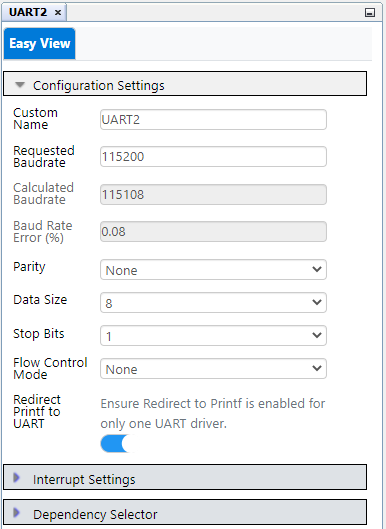
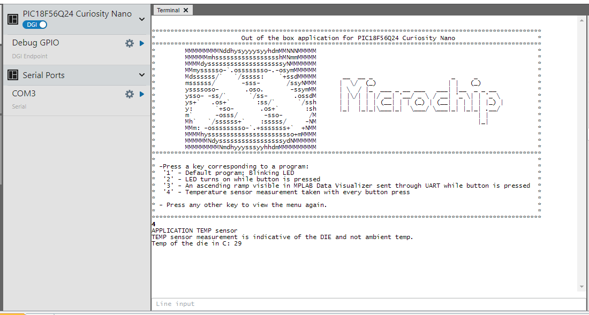

# Curiosity Nano Out-of-the-Box Code using PIC18F56Q24 Microcontroller with MCC Melody

This project comes preloaded on the PIC18F56Q24 Curiosity Nano board with four programs and a command line that enables choosing between those programs.

- The first program is a simple LED blinking program. The microcontroller starts with this program being activated.
- The second program turns on the existing on-board LED by pressing a button on the Curiosity Nano board
- The third program sends an 8-bit counter through UART when the on-board button is pressed. This increases the counter.
- The fourth program takes a temperature measurement using the ADC, NVM, and FVR modules

The main program is changed by sending one of the numbers 1, 2, 3 or 4, through UART interface. Any other key will return the menu.

## Related Documentation

For more details and code examples on the PIC18F56Q24 click on the following links:

- [PIC18F56Q24 Product Page](https://www.microchip.com/wwwproducts/en/PIC18F56Q24)
- [PIC18F56Q24 Code Examples on GitHub](https://github.com/microchip-pic-avr-examples?q=PIC18F56Q24)

## Software Used

- [MPLAB® X IDE  v6.15 or newer](http://www.microchip.com/mplab/mplab-x-ide)
- [MPLAB® XC8 v2.45 or newer](http://www.microchip.com/mplab/compilers)
- [PIC18F-Q_DFP v1.23.422 or newer Series Device Pack](https://packs.download.microchip.com/)
- [nEDBG_TP v1.13.713](https://packs.download.microchip.com/)
- [MPLAB® Data Visualizer](https://www.microchip.com/en-us/tools-resources/debug/mplab-data-visualizer)

## Hardware Used

- PIC18F56Q24 Curiosity Nano Development Board is used as a test platform.

   

## Operation

To program the Curiosity Nano board with this MPLAB® X project, follow the steps provided in the [How to Program the Curiosity Nano Board](#how-to-program-the-curiosity-nano-board) chapter. 

## 1. Setup

The following peripheral and clock configurations are set up using MPLAB® Code Configurator (MCC) Melody for the PIC18F56Q24:

   

- **Clock Control:**
  - Clock Source: HFINTOSC
  - HF Internal Clock: 64_MHz
  - Clock Divider: 1
   

- **Configuration Bits:**
  - CONFIG1 & CONFIG5:
    - Disable external oscillator, and change the reset oscillator to 64_MHz
    - WDT operating mode: WDT Disabled; SWDTEN is ignored
   

- **UART2:**
  - UART PLIB Selector: UART2
  - Requested Baudrate: 115200
  - Parity: None
  - Data Size: 8
  - Stop Bits: 1
  - Redirect Printf to UART: Enabled
   

**Note:** Notice the change in default baud rate, this change should be reflected in data visualizer.

   

- **UART2PLIB:**
  - Enable UART: Enabled
  - Enable Receive: Enabled
  - Enable Transmit: Enabled
   

- **ADCC**
- Mode: Low Pass Filter
- Positive Reference: FVR
- Clock Source: ADCRC

 

- Repeat Value: 10
- Accumulator Right Shift: 4

 

- **FVR**
- FVR: Enabled
- Temp Sensor: Enabled
- Temp Sensor Range: High
- ADC FVR: 2X

 

- **Pin Grid View:**
  - UART2 RX2 input: RB4
  - UART2 TX2 output: RB5
  - GPIO input: RF3
  - GPIO output: RF2
   

- **Pins:**
  - RB4:
    - Module: UART2
    - Function: RX2
  - RB5:
    - Module: UART2
    - Function: TX2
  - RF3:
    - Function: GPIO
    - Direction: input
    - Custom Name: Button
    - Weak Pullup: Enabled
  - RF2:
    - Function: GPIO
    - Direction: output
    - Custom Name: LED
   

**Note:**
  - Pin RF3 (Button) has weak pull-up enabled
  - UART2 is routed to CDC pins for more flexibility (TX = RB5, RX = RB4)

The following pin configuration must be made for this project:

|   Pin    | Configuration  | Function    |
| :------: | :------------: | :---------: |
|   RB5    | Digital output | UART2 TX    |
|   RB4    | Digital input  | UART2 RX    |
|   RF2    | Digital output | LED         |
|   RF3    | Digital input  | Button      |

## 2. Demo

### 2.1. LED Blink

The first program is a simple LED blinking program. The program is activated when the microcontroller is plugged in.
To run the first project, send the command `1` through UART using the Data Visualizer. After sending this command, the terminal will receive the following message: `"APPLICATION blink LED"`.
 

### 2.2. Push the button to turn on the LED

The second program turns on the on-board LED by pressing the on-board button on the Curiosity Nano board.
To run the second project, send the command `2` through UART using the Data Visualizer. After sending this command, the terminal will receive the following message: `"APPLICATION press button to turn on LED"`.
 

### 2.3. Ramp on Data Visualizer

While the on-board button is pressed, the third program sends an 8-bit counter through UART and increases the counter.
To run the third project, send the command `3` through UART using Data Visualizer. After sending this command, the terminal will receive the following message:`"APPLICATION press button to send a ramp through UART"`.

Follow the steps in the **How to use MPLAB® Data Visualizer** section to set up the Data Visualizer. It will correctly display the ramp through UART2 sent by pressing the button.

 

### 2.4 Temperature Sensor Reading

The fourth program takes an internal temperature measurement when the on-board button is pressed.
To run the fourth project, send the command `4` through UART using the Data Visualizer. After sending this command, the terminal will receive the following message: `"APPLICATION TEMP sensor"`.

 

**Note:** By pressing any other key, the program returns the menu through UART using the software terminal.

## 3. Summary

This project is an out-of-the-box experience for the first-time user. It showcases the basic features of the Curiosity Nano Development platform.

## How to use MPLAB® Data Visualizer

This section illustrates how to use the MPLAB X Data Visualizer to send commands and receive information, but prior to programming the PIC18F56Q24 Curiosity Nano Board. This can be applied to any other projects.

1. Open the software terminal in MPLAB® X IDE. Left click the **Data Visualizer** button.

 

2. Prepare settings in Data Visualizer.

- Left click on the specific serial port communication **COMx**
- Set the correct **Baud Rate**
- Select the right **Input Source**

 

3. Start using the programs. Press the **Start** button. Left click on **Line input**, type any key, send commands.

 

**Note:** The next steps must be followed to run the third program.

4. Prepare MPLAB Data Visualizer. Right click on **Important files**, click **Add Item to Important Files...** .

 

**Note:** Follow step 5 if there is no existing setup file for Data Visualizer, otherwise go to Step 6.

5. Prepare MPLAB Data Visualizer.

- In the **Connections** tab, at the **COMx** option, press **New variable streamer...**
- Type a specific **Variable Streamer Name**
- Choose **Ones' Complement** from the **Framing Mode** dropdown menu
- Type a specific value from the **Start of Frame**, press **Add a variable**
- Type a specific name for the variable name in **Variable Name**
- Press **Next**, then press **Next** again
- Save these settings using **Save As** button as a DVWS file

 

6. Add the DVWS file to see the ramp using Data Visualizer. Click the **\*.DVWS file** and **Select**.

 

7. See the expected result on Data Visualizer.

- Double click on the **\*.dvws file** from **Important Files**, or right click and select **Open with Data Visualizer**, or directly press **Load** button on the **MPLAB Data Visualizer** tab and select the file.
- Select **Source** from Time Plot window
- Click **Start Streaming COMx** the communication serial port in the **Variable Streamers** tab
- Click **Scroll axis automatically**.

 

##  How to Program the Curiosity Nano board

This chapter shows how to use the MPLAB X IDE to program an PIC® device with an Example_Project.X. This can be applied for any other projects.

- Connect the board to the PC.

- Open the Example_Project.X project in MPLAB X IDE.

- Set the Example_Project.X project as main project.

  - Right click on the project in the **Projects** tab and click **Set as Main Project**
     

- Clean and build the Example_Project.X project.

  - Right click on the **Example_Project.X** project and select **Clean and Build**
     

- Select the **PICxxxxx Curiosity Nano** in the Connected Hardware Tool section of the project settings:

  - Right click on the project and click **Properties**
  - Click on the arrow under the Connected Hardware Tool
  - Select the **PICxxxxx Curiosity Nano** (click on the **SN**), click **Apply** and then click **OK**:
     

- Program the project to the board.
  - Right click on the project and click **Make and Program Device**
     

 

- [Back to Setup](#1-setup)
- [Back to Demo](#2-demo)
- [Back to Summary](#3-summary)
- [Back to Top](#curiosity-nano-out-of-the-box-code-using-pic18f56q24-microcontroller-with-mcc-melody)
